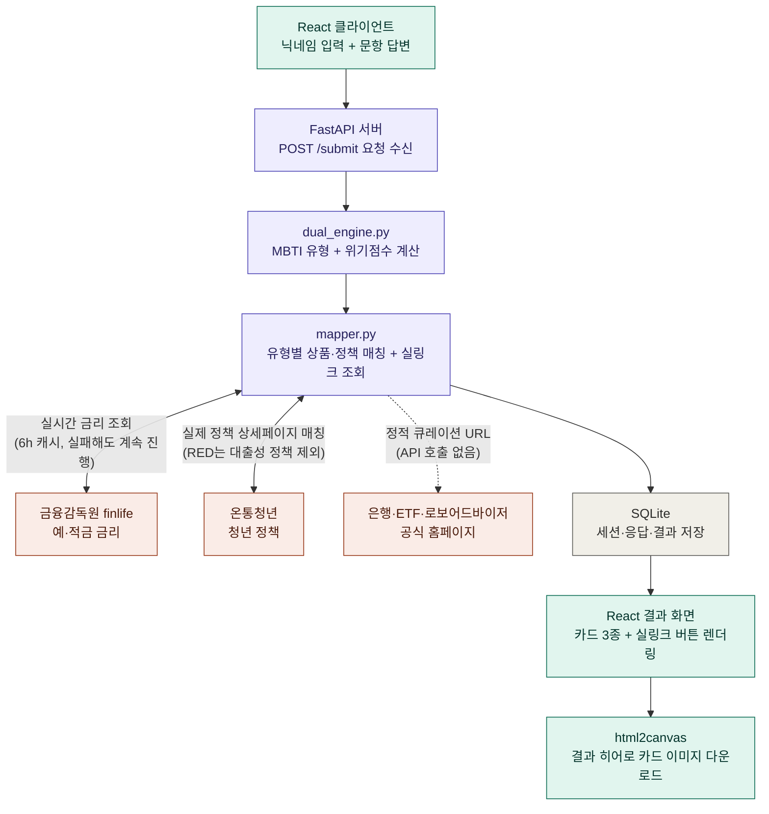

# DOTORI (Finance-MBTI) 아키텍처

**한 줄 요약**: React SPA → FastAPI 단일 서버 → SQLite, 그리고 세 개의 외부 공공 API(금감원/서민금융진흥원/온통청년)를 백엔드가 감싸서 실시간 금리·정책 정보를 정적 데이터에 얹는 구조입니다.

```
[React/Vite (3001)] ──HTTP──▶ [FastAPI (8001)] ──▶ [SQLite: dotori.db]
                                     │
                                     ├─▶ finlife.fss.or.kr   (금감원, 예·적금 금리)
                                     ├─▶ apis.data.go.kr     (서민금융진흥원, 대출상품)
                                     └─▶ youthcenter.go.kr   (청년정책)
```

## 1. Frontend (`frontend/src/`)

- **App.tsx**: 상태 기반 화면 전환기 (닉네임 → 로딩 → 퀴즈 → 제출중 → 결과/에러), 라우터 없이 단일 컴포넌트가 조건부 렌더링
- **hooks/useQuizSession.ts**: 전체 퀴즈 상태 머신. `sessionStorage`에 UUID를 저장해 세션 식별, 마지막 문항 응답 시 자동 제출
- **services/api.ts**: 백엔드 호출 래퍼 (`/questions`, `/submit`), 타입 정의 공유
- **pages/**: NicknamePage → QuizPage → ResultPage
- **components/quiz, result/**: ProgressBar, QuizCard, ProductCard, ResultBanner

## 2. Backend (`backend/app/`)

- **main.py**: FastAPI 앱 진입점, CORS, 시작 시 `Base.metadata.create_all`로 테이블 자동 생성
- **api/diagnosis.py**: 라우터. `/questions`, `/submit`(핵심), `/youth-products`, `/youth-policies`
- **core/dual_engine.py**: 진단 로직 — `questions.json`/`types.json`을 읽어 4글자 MBTI 코드 + 위기점수(🟢/🟡/🔴)를 이중 계산
- **core/mapper.py**: MBTI 결과에 매핑된 실제 상품/정책 추천 카드 3종 생성 — 가능하면 실시간 금리로 보강하고, 정책/상품 카드에는 실제 상세페이지 링크까지 붙여서 반환
- **core/youth_product_matcher.py**: `types.json`에 큐레이션된 화이트리스트 상품명(토스뱅크 통장 등)을 finlife API 응답에서 찾아 실시간 금리 주입, 은행·ETF·로보어드바이저 공식 홈페이지 URL은 API 호출 없이 정적 큐레이션 목록에서 매칭 — 두 경우 모두 실패해도 정적 설명으로 자연스럽게 폴백
- **core/youthcenter_client.py**: 온통청년 API 클라이언트 겸, 유형별로 가장 가까운 실제 정책 1건과 그 상세페이지 링크를 매칭 (`pick_real_policy`/`extract_policy_url`) — 위기 신호등이 RED면 대출성 정책을 우선 제외
- **core/finlife_client.py / kinfa_client.py**: 나머지 2개 외부 공공 API 클라이언트. 공통 패턴: API 키 없으면 조용히 빈 리스트 반환, 6시간 메모리 캐시, 실패 시 이전 캐시로 폴백 → 외부 API 장애가 서비스 전체를 막지 않음
- **core/keyword_filter.py**: API마다 필드명이 다른 원본 상품/정책 리스트에서 "청년 대상" 여부를 정규식+키워드로 판별하는 공용 필터 (오탐 방지용 블랙리스트 포함)
- **schemas/diagnosis.py**: Pydantic 요청/응답 검증 (7문항 필수 응답, choice_index 0~3 범위 등)
- **db/models.py, session.py**: SQLAlchemy ORM (Session/Response/Result 3테이블), WAL 모드 SQLite
- **data/questions.json, types.json**: 정적 콘텐츠(문항, 16유형 정의) — 코드와 분리되어 비개발자도 수정 가능
- **scripts/**: API 응답 구조 파악용 1회성 조사 스크립트 (check_env, inspect_*, list_youth_*)

## 설계상 특징

1. **이중 진단 엔진**: MBTI 성향(4문항) + 재정위기 신호등(3문항)을 분리 계산 후 라벨 결합
2. **Graceful degradation이 전역 원칙**: 외부 API 키 미설정/실패, DB 쓰기 실패 모두 예외를 삼키고 계산 결과는 항상 반환 — PoC 안정성 최우선 설계
3. **정적 데이터 + 실시간 보강 하이브리드**: 16유형 상품 설명은 정적이되, 화이트리스트에 걸리는 5개 은행 상품만 실시간 금리로 덮어씀
4. **무인증 세션**: 로그인 없이 UUID 기반 세션으로 응답/결과를 SQLite에 기록, 재제출 시 기존 레코드 삭제 후 재저장
5. **실링크 큐레이션**: 정책은 온통청년 API에서 유형별 최근접 1건을 실시간 매칭, 은행/ETF/로보어드바이저는 API 호출 없이 검증된 URL을 정적 큐레이션 — 결과 카드에서 바로 실제 상세페이지로 이동 가능

## 3. 요청 흐름 (진단 제출 ~ 결과 저장)


